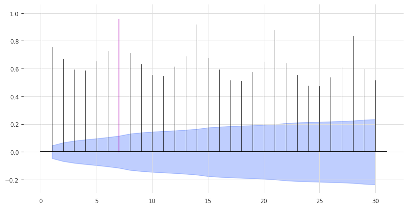
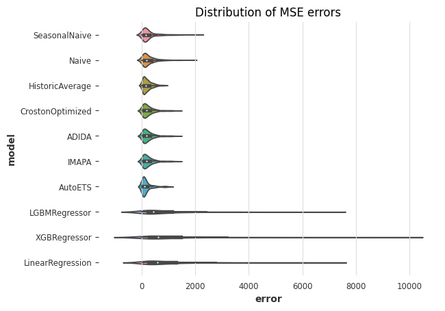
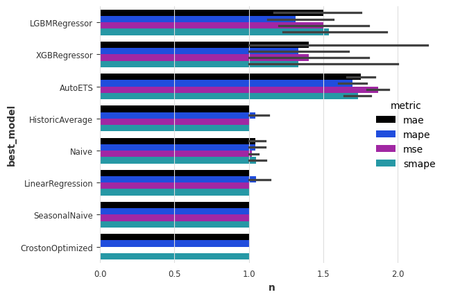
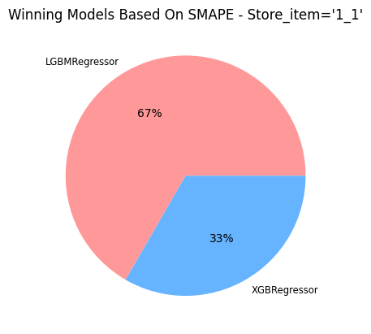
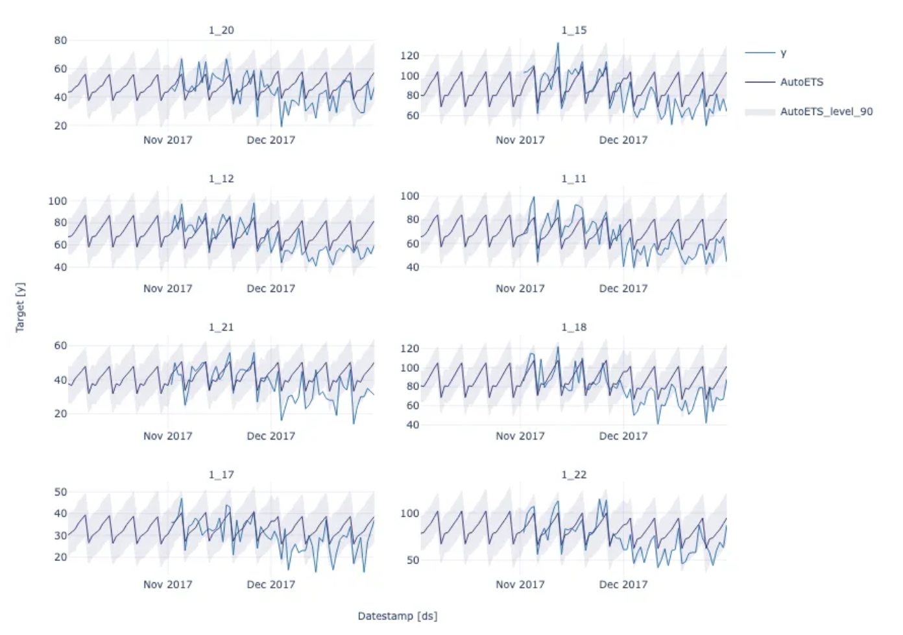

# Part 1 - Multiple Timeseries Forecasting

# Dataset

In this tutorial, we will train and evaluate multiple time-series forecasting models using the [Store Item Demand Forecasting Challenge dataset from Kaggle](https://www.kaggle.com/competitions/demand-forecasting-kernels-only/data?select=train.csv). This dataset has 10 different stores and each store has 50 items, i.e. total of 500 daily level time series data for five years (2013–2017).

# Download data

* Download the train.csv from https://www.kaggle.com/competitions/demand-forecasting-kernels-only/data?select=train.csv.
* Create a `./data` directory inside the directory of this Python notebook
* Save the train.csv inside the `./data` directory


<div>
<table border="1" class="dataframe">
  <thead>
    <tr style="text-align: right;">
      <th></th>
      <th>date</th>
      <th>store</th>
      <th>item</th>
      <th>sales</th>
    </tr>
  </thead>
  <tbody>
    <tr>
      <th>0</th>
      <td>2013-01-01</td>
      <td>1</td>
      <td>1</td>
      <td>13</td>
    </tr>
    <tr>
      <th>1</th>
      <td>2013-01-02</td>
      <td>1</td>
      <td>1</td>
      <td>11</td>
    </tr>
    <tr>
      <th>2</th>
      <td>2013-01-03</td>
      <td>1</td>
      <td>1</td>
      <td>14</td>
    </tr>
    <tr>
      <th>3</th>
      <td>2013-01-04</td>
      <td>1</td>
      <td>1</td>
      <td>13</td>
    </tr>
    <tr>
      <th>4</th>
      <td>2013-01-05</td>
      <td>1</td>
      <td>1</td>
      <td>10</td>
    </tr>
  </tbody>
</table>
</div>


    The dataset has 913000 rows and 4 columns


# Data fields

* date - Date of the sale data. There are no holiday effects or store closures.
* store - Store ID
* item - Item ID
* sales - Number of items sold at a particular store on a particular date.


# Plot total sales for all products over time

    

    


# Check for seasonality in the total number of 'sales' per 'date'

    

    


The ACF presents a spike at x in [1, 7, 14, 21], which suggests a weekly seasonality trend (highlighted). The blue zone determines the significance of the statistics for a confidence level of $\alpha = 5\%$. We can also run a statistical check of seasonality for each candidate period `m`.


## We will train multiple Statistical & ML models and evaluate which one performs best

# Create forecasts with Stats & Ml methods.

# Stats Methods with StatsForecast


```python
# Import necessary models from the statsforecast library
from statsforecast.models import (
    # SeasonalNaive: A model that uses the previous season's data as the forecast
    SeasonalNaive,
    # Naive: A simple model that uses the last observed value as the forecast
    Naive,
    # HistoricAverage: This model uses the average of all historical data as the forecast
    HistoricAverage,
    # CrostonOptimized: A model specifically designed for intermittent demand forecasting
    CrostonOptimized,
    # ADIDA: Adaptive combination of Intermittent Demand Approaches, a model designed for intermittent demand
    ADIDA,
    # IMAPA: Intermittent Multiplicative AutoRegressive Average, a model for intermittent series that incorporates autocorrelation
    IMAPA,
    # AutoETS: Automated Exponential Smoothing model that automatically selects the best Exponential Smoothing model based on AIC
    AutoETS
)
```


# ML Methods with MLForecast


```python
# Import the necessary models from various libraries

# LGBMRegressor: A gradient boosting framework that uses tree-based learning algorithms from the LightGBM library
from lightgbm import LGBMRegressor

# XGBRegressor: A gradient boosting regressor model from the XGBoost library
from xgboost import XGBRegressor

# LinearRegression: A simple linear regression model from the scikit-learn library
from sklearn.linear_model import LinearRegression
```


# Forecast Plots


# Plot Cross Validation (CV)


# Distribution of erros per model and evaluation metrics

    

        

# In how many cross validation fold & metric is each model overperforming the rest?
    

    

## AutoETS is the best performing model for all evaluation metrics

## This does not mean that AutoETS is the best performing model for each individual "store_item"

# What is the best model for store_item="1_1" sales forecasting?

    
    


XGBRegressor was the best performing model based on MSE for 2 out of the 3 validation folds of store_item 1_1.

    

    


LGBMRegressor was the best performing model based on MSE for 2 out of the 3 validation folds of store_item 1_1.

# Visualize the forecasts (XGBRegressor & LGBMRegressor) of the best model for unique_id == "1_1"


# Visualize the AutoETS forecasts for more unique_ids




# Sources

This code is based on the following publicly available resources
* [Nixtla Statistical, Machine Learning and Neural Forecasting methods](https://nixtla.github.io/statsforecast/docs/tutorials/statisticalneuralmethods.html)
* [Intro to Forecasting with Darts](https://github.com/unit8co/darts/blob/master/examples/00-quickstart.ipynb)
* [Store Item Demand Forecasting Challenge dataset from Kaggle](https://www.kaggle.com/competitions/demand-forecasting-kernels-only/data?select=train.csv)

# Part 2 - Multiple Timeseries Forecasting with Covariates - Cracking the Code 👩‍💻📈 Predicting Crypto Prices with Multiple TimeSeries and Covariates

Use time series forecasting models with covariates ('Days Until Bitcoin Halving', 'Fear & Greed Index') to predict crypto prices (BTC, ETH, DOT, MATIC, SOL).

Our objective is to employ the training series for forecasting cryptocurrency prices within the validation series, assess model accuracy through metrics, and determine the best-performing model for the task at hand.

# Disclaimer

This article is solely intended for educational purposes and does not constitute financial advice. It focuses on the development and evaluation of time series forecasting models with covariates using a simplified real-world example. The results obtained from this model should not be used for automated trading activities.

# What's New in Part 2?

In part two we discuss how to: 
* **Add covariates** to your timeseries forecasting model
* **Backvalidate model predictions**

# Covariates: Leveraging External Data 

In addition to the target series (the series we aim to forecast), many models in Darts also accept covariate series as input. 

**Covariates** are series that we don't intend to predict but can offer valuable supplementary information to the models. Both targets and covariates can be either multivariate or univariate.

There are two types of covariate time series in Darts:

* `past_covariates` consist of series that may not be known in advance of the forecast time. These can, for example, represent variables that need to be measured and aren't known ahead of time. Models don't use future values of past_covariates when making predictions.
* `future_covariates` include series that are known in advance, up to the forecast horizon. These can encompass information like calendar data, holidays, weather forecasts, and more. Models capable of handling future_covariates consider future values (up to the forecast horizon) when making predictions.


Each covariate can potentially be multivariate. If you have multiple covariate series (e.g., month and year values), you should use `stack()` or `concatenate()` to combine them into a multivariate series.

In the following cells, we use the `darts.utils.timeseries_generation.datetime_attribute_timeseries()` function to generate series containing month and year values. We then `concatenate()` these series along the "component" axis to create a covariate series with two components (month and year) for each target series. For simplicity, we directly scale the month and year values to a range of approximately 0 to 1.


# Prediction Backvalidation 

# Time Series Backvalidation

The `historical_forecasts` feature in Darts assesses how a time series model would have performed in the past by generating and comparing predictions to actual data. Here's how it works:

* **Model Training:** Train your time series forecasting model using historical data.
* **Historical Forecasts:** Use the function to create step-by-step forecasts for a historical period preceding the training data.
* **Comparison:** Compare historical forecasts to actual values from that period.
* **Performance Evaluation:** Apply metrics like MSE, RMSE, or MAE for quantitative assessment.
* **Insights and Refinement:** Analyze the results to gain insights and improve the model.

This process is essential for validating a model's historical performance, testing different strategies, and building confidence in its accuracy before real-time use.


# Sources

* This article uses code examples from [Darts quickstart](https://unit8co.github.io/darts/quickstart/00-quickstart.html). You can refer to [Darts documentation](https://unit8co.github.io/darts/index.html) for more examples.
* [Alternative.me Crypto Fear & Greed Index](https://alternative.me/crypto/fear-and-greed-index/)
* [Bitcoin Halving: How It Works and Why It Matters](https://www.forbes.com/advisor/au/investing/cryptocurrency/bitcoin-halving/), by Matt Whittaker and Patrick McGimpsey in Forbes.com
# Store-Item-Demand-Crypto-Price-Prediction-using-Multiple-Time-Series-Forecasting

